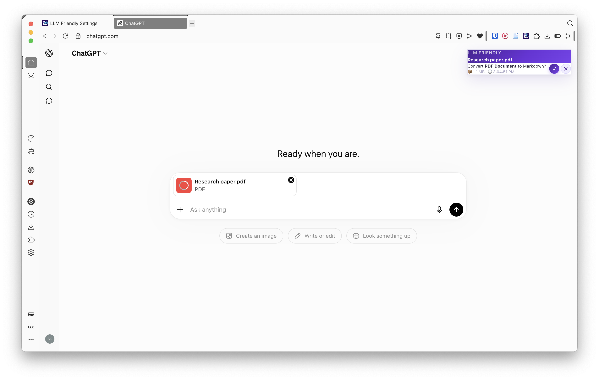
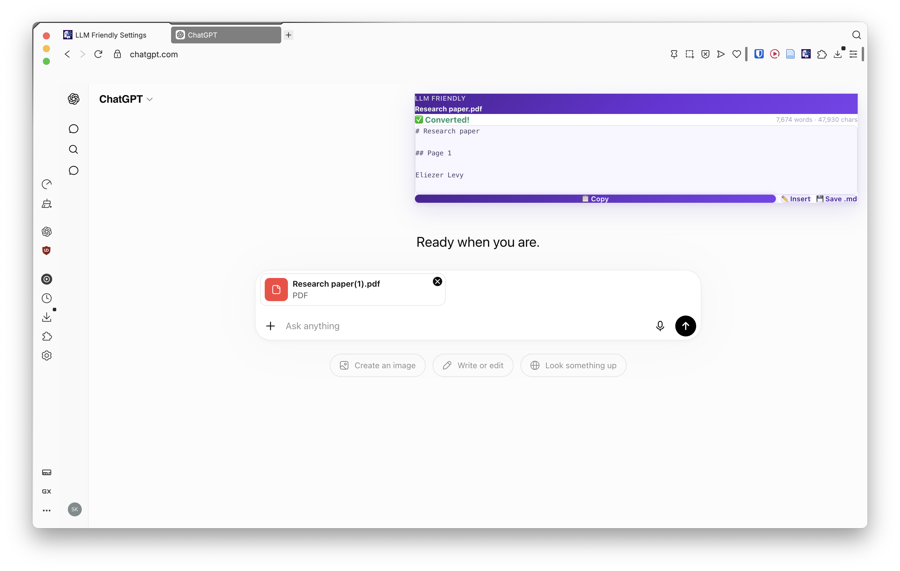
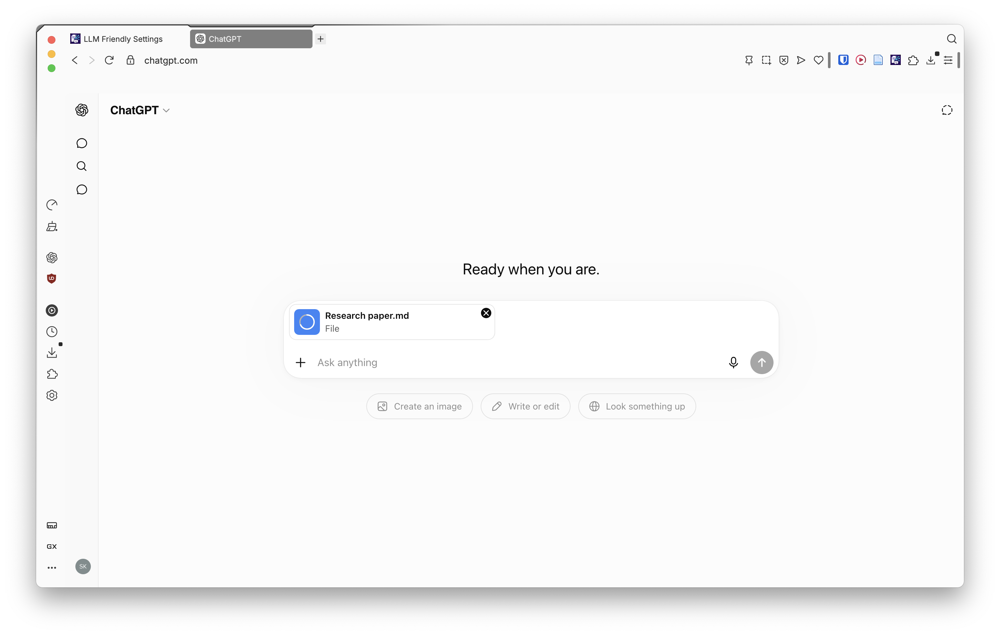
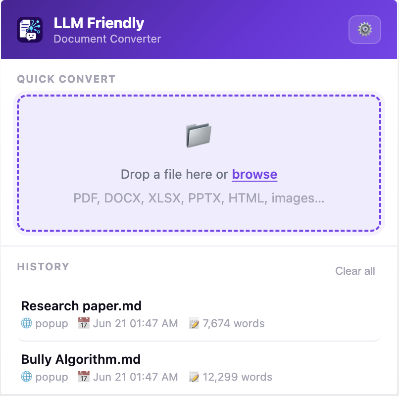
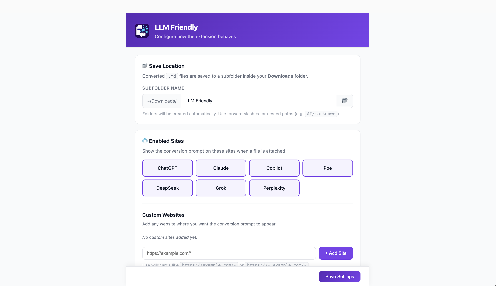
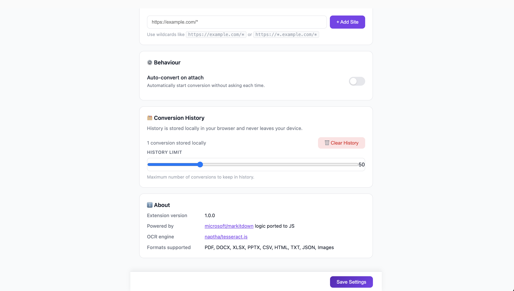

# LLM Friendly Browser Extension

Convert PDF, DOCX, XLSX, PPTX, HTML, CSV, plain text, JSON and image files to Markdown directly inside AI‑chat websites.

---

## About
LLM Friendly is a browser extension that helps Large Language Models process your documents more efficiently by converting PDFs, Word documents, Excel spreadsheets, PowerPoint presentations, HTML pages, CSV files, JSON data, plain text files, and images into structured Markdown or text directly inside AI chat platforms. 

Many users regularly upload PDFs, images, spreadsheets, presentations, and other documents to Large Language Models for analysis, summarization, and question answering. However, these formats often contain complex layouts, formatting metadata, embedded objects, and structural overhead that consume additional tokens. By transforming documents into clean, AI-friendly Markdown, LLM Friendly removes unnecessary overhead and presents content in a format that LLMs can process more efficiently, allowing models to focus on the information that matters most while maximizing available context and reducing token consumption.


## Features

- **One‑click conversion** - drop a file, click **Convert**, get Markdown instantly.
- **Auto‑convert** (optional) - start conversion automatically when a file is attached or pasted.
- **Insert / Copy / Save** - insert generated Markdown into the chat input, copy to clipboard, or download as `.md`.
- **History** - locally stored conversion history (never leaves your browser).
- **OCR support** - images processed with Tesseract.js before Markdown conversion.
- **Custom sites** - enable the conversion prompt on any website of your choice.
- **Privacy‑first** - all conversion runs on local device. No data is sent to external servers.

---


## Installation

### 1. Chrome Web Store (Under review)


### 2. Manual (development / unpacked version)

```bash
# Clone the repo (if you haven’t)
git clone https://github.com/shibi1306/llm‑friendly‑extension.git
cd llm‑friendly‑extension
npm install
npm run build          # produces ./dist
# Load unpacked:
#   Chrome/Edge/Brave → chrome://extensions → Enable “Developer mode” → Load unpacked → select ./dist
```

---

## How to Use

### Document Conversion

1. Open a supported chat site and attach a file via the paper‑clip, drag‑&‑drop, or paste (Ctrl + V).



2. Click **Convert (✓)** to start conversion, or **Skip (✕)** to let the original file upload through. A spinner shows while the conversion runs.



3. Once complete, choose what to do with the Markdown:
   - **Copy (📋)** — copy Markdown to clipboard.
   - **Insert (✏️)** — attach the `.md` file into the chat input.
   - **Save (💾)** — download as `.md` (saved to `~/Downloads/LLM Friendly/` by default).



### Extension Popup

Click the extension icon in the toolbar to open the popup. Here you can drag‑or‑select a file to convert without needing a file input on the page, and browse your local conversion history. Each history item lets you **Copy**, **Insert**, or **Save** the previously converted Markdown.



### Settings

Open the extension **Options** (via the popup ⚙️ or right‑click → Options) to configure:

- **Download folder** — pick a custom subfolder inside `~/Downloads/`.
- **Auto‑convert** — skip the prompt and start conversion automatically.
- **Custom sites** — enable the conversion prompt on any website of your choice.



You can also manage your conversion **history**, set the maximum number of items to keep, and clear the history from the settings page.

 

---

## Known Limitations

| Issue | Description | Work‑around / Status |
|-------|-------------|----------------------|
| **Safari / Firefox builds** | No packaged `.xpi` or safari web‑extension yet. | See *Future Work* below. |
| **Very large files** | Multi‑hundred‑MB PDFs/DOCX can take noticeable time. | Split files or accept modest delay. |
| **Complex layouts** | Multi‑column tables, merged cells, or intricate formatting may lose layout. | Output focuses on readable text; manual tweaks may be needed. |
| **OCR language** | Tesseract.js defaults to English; non‑English images may need language packs. | Future work - add language selector. |

---

## Future Work

- **Safari & Firefox extensions** - adapt manifest and build scripts for those stores. publish to Mozilla Add‑ons and Apple App Store (via Safari Web Export).
- **Deep OCR integration** - run OCR on images **inside** DOCX, XLSX, PPTX, and PDF before feeding extracted text to Markitdown, enabling searchable Markdown from scanned documents.
- **User‑selectable OCR language** - expose Tesseract language packs in the Options page.
- **Service‑worker robustness** - improve handling of extension updates and contextual invalidation to reduce “Extension context invalidated” errors.
- **Automated tests** - add Jest/WebDriverCI tests for converters and UI.

---

## Acknowledgments

- **[Markitdown](https://github.com/microsoft/markitdown)** - the original Python library that powers the Markdown conversion logic (ported to JavaScript for this extension).
- **[Tesseract.js](https://github.com/naptha/tesseract.js)** - the OCR engine used to extract text from images.
- **Additional libraries** - `pdf.js`, `mammoth`, `turndown`, `sheetjs`, `fflate`, `xlsx`, `webextension-polyfill`, etc.

---

## Privacy
LLM Friendly is designed with privacy in mind. All file processing happens locally in your browser-none of your data is ever transmitted to external servers. For full details, see the [Privacy Policy](PRIVACY.md).


## License

LLM Friendly is licensed under the MIT License.

This project includes code derived from Microsoft's MarkItDown project
(MIT License) and uses Tesseract.js/Tesseract OCR (Apache License 2.0).
See THIRD_PARTY_NOTICES.md for details.

## Source Code

GitHub: https://github.com/shibi1306/LLM-Friendly